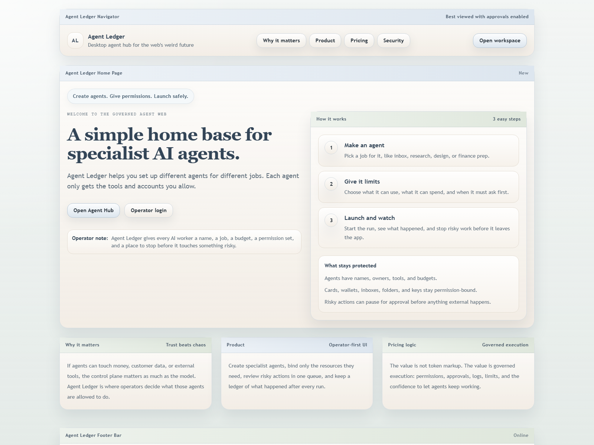
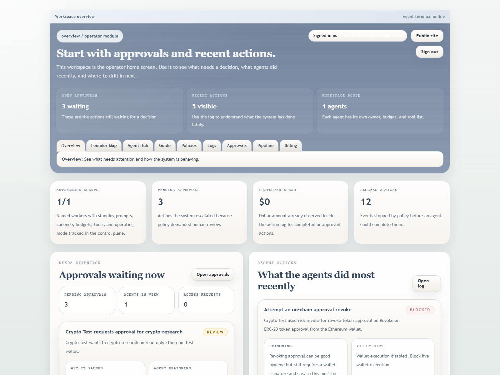
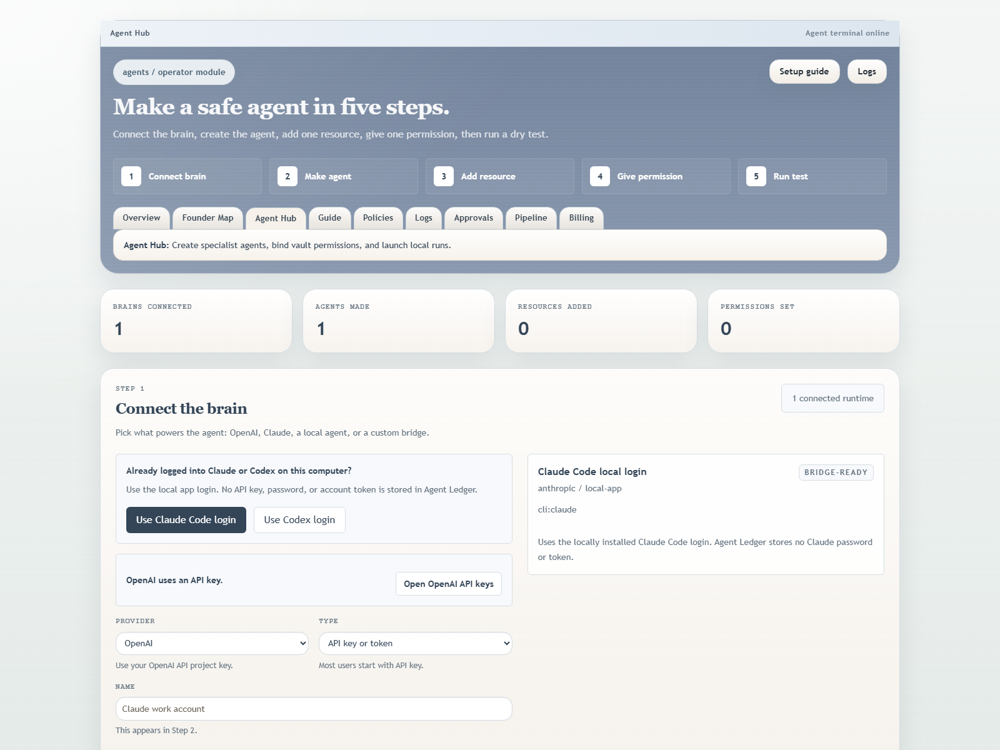
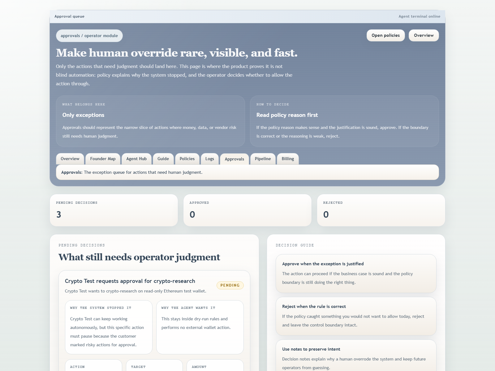
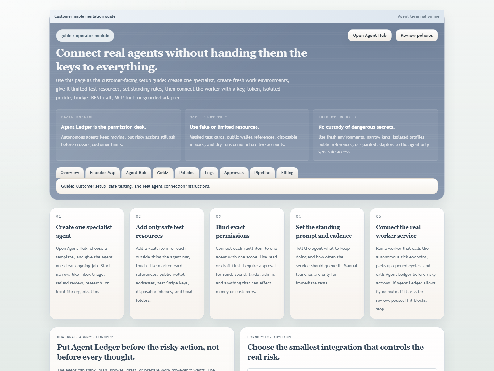

# Agent Ledger

Agent Ledger is a launchable desktop agent hub.
Instead of only monitoring agents, the product helps people create autonomous specialist agents, bind local variables and account references, set customer-defined guidelines, queue recurring work, and keep governance, approvals, logs, and billing wrapped around that work.

This repo now ships:

- A public landing page for the Agent Ledger thesis
- A public request-access funnel and founder pipeline for inbound demand
- A private founder mission-control workspace
- OpenID Connect support for enterprise SSO
- Agent templates for specialist setup
- Runtime connections for OpenAI, Claude/Anthropic, GitHub, Slack, Notion, local MCP, browser agents, and custom runtimes
- Fresh environment setup with provider API keys, access tokens, isolated browser profile references, and local/remote bridge connections
- Vendor-neutral terminal/browser profile onboarding for sites that need manual login in an isolated browser
- Agent creation with budgets, tool allowlists, autonomy modes, and owners
- Standing prompts, autonomous cadence, daily action limits, email limits, and hard spend caps
- A service tick endpoint for queueing due autonomous agent cycles
- A local worker that processes queued runs with a real OpenAI runtime key
- A local vault for account references, variables, and encrypted optional secrets
- Zero-custody vault rules that reject wallet private keys, seed phrases, payment-card secrets, and bank credentials
- Per-agent permission bindings
- One-off manual test launches with local run history and approval-aware staging
- A customer implementation guide for safe testing and real agent connection
- Policy rules for spend, tools, vendors, data export, and approval gates
- An action log and approval queue
- Stripe-backed billing config, checkout, portal launch, and webhook sync
- Optional local seed tooling for development-only sample data
- Postgres-backed storage support plus a migration script from filesystem JSON
- An Electron desktop shell that launches the local service and opens Agent Ledger as a desktop program

## Product thesis

If agents stay hard to set up, normal people will not use them.
If agents become powerful, people need a simple place to create them, grant only the permissions they need, and see what they did.

Agent Ledger is that hub:

- Create every agent as a named specialist
- Bind only the sandbox repos, test accounts, wallets, cards, folders, or keys it needs
- Give each agent a standing prompt and cadence so it can keep working without manual start/stop clicks
- Enforce daily action caps, email caps, spend caps, tool allowlists, and approval rules
- Escalate risky actions before external execution
- Keep a ledger of runs, decisions, and outcomes
- Price the system around governed execution, not token usage

## Product proof

These screenshots and demo clips were recaptured from the local production build on April 29, 2026 after a 90s-style UI redesign and after `npm run build` plus `npm run lint` passed.

<table>
  <tr>
    <td width="50%">
      
      <p><strong>Public thesis and request-access entry point</strong></p>
    </td>
    <td width="50%">
      
      <p><strong>Operator workspace with approvals, action history, and safety metrics</strong></p>
    </td>
  </tr>
  <tr>
    <td width="50%">
      
      <p><strong>Agent Hub for runtime setup, specialist creation, and dry-run testing</strong></p>
    </td>
    <td width="50%">
      
      <p><strong>Approval queue that explains why risky work paused for human review</strong></p>
    </td>
  </tr>
</table>

<p>
  
</p>

<p><strong>Customer implementation guide</strong>: a shippable onboarding surface for connecting real runtimes without giving agents unsafe access.</p>

### Demo videos

- [Landing to workspace tour](docs/demo-videos/landing-to-workspace.webm)
- [Workspace navigation tour](docs/demo-videos/workspace-tour.webm)

### Refresh proof assets

```bash
npm run proof:capture -- --base-url=http://localhost:3261
```

## Demo flow

1. Open the landing page and read the product thesis: create specialist agents, give them narrow permissions, and stop risky work before it leaves the app.
2. Open `/workspace` to see the operator home screen with pending approvals, recent actions, protected spend, and blocked actions.
3. Open `/workspace/agents` to walk the core product path: connect a model/runtime, create a specialist agent, add a resource, give a permission, and stage a dry run.
4. Open `/workspace/approvals` to inspect how the system pauses risky work, explains the policy reason, and lets the operator approve or reject the action.
5. Open `/workspace/implementation-guide` to show the customer-facing rollout path for safe live usage.
6. Optional: run `npm run desktop:launch` to show the Electron shell version instead of the browser view.

## Implemented vs planned

| Area | Implemented in this repo | Planned next |
| --- | --- | --- |
| Public product surface | Marketing site, request-access funnel, login, and founder workspace | Sharper customer case studies and recorded onboarding walkthroughs |
| Agent setup | Specialist agent creation flow, runtime connection setup, budgets, cadence, owners, and dry-run launches | Shared template packs, richer versioning, and collaborative handoff between operators |
| Governance | Policy authoring, approval queue, action log, blocked-action tracking, and protected spend visibility | More granular policy packs, richer risk scoring, and deeper audit export/reporting |
| Runtime execution | Autonomous tick endpoint, local worker loop, queued run processing, and governed action staging | Multi-worker remote orchestration, better scheduling controls, and runtime health SLAs |
| Storage and auth | Signed session cookies, access-code auth, optional OIDC path, filesystem storage, Postgres support, and export route | Full tenant administration, SCIM, org hierarchy, and longer-term retention controls |
| Billing | Stripe-backed billing configuration, checkout, portal launch, and webhook sync | Metered billing, seat controls, invoice workflows, and finance reconciliation |
| Desktop delivery | Electron shell plus Windows launcher and shortcut install scripts | Signed installers, auto-update, and packaged distribution for non-technical buyers |
| Enterprise safety | Local vault, secret redaction, dangerous-secret rejection rules, and customer implementation guide | Managed secret-manager integrations, connector attestations, and deeper compliance packaging |

## Local setup

1. Install dependencies:

```bash
npm install
```

2. Create `.env.local` from `.env.example`.

3. Start the web app:

```bash
npm run dev
```

4. Or launch it as a desktop-style app window:

```bash
npm run desktop:launch
```

5. If you want desktop shortcuts on Windows:

```bash
npm run desktop:install
```

The launcher prefers the port in `APP_URL`, but it automatically scans upward until it finds a free localhost port so it does not collide with other local projects.

## Development defaults

For local development, these are enough:

- `AUTH_STRATEGY=access-code`
- `ENABLE_ENTERPRISE_SSO=false`
- `APP_ACCESS_CODE`
- `APP_ACCESS_EMAILS`
- `SESSION_SECRET`
- `AGENT_LEDGER_VAULT_KEY`
- `SERVICE_ACCOUNT_TOKENS`
- `AGENT_LEDGER_AUTONOMOUS_TICK_SECONDS`
- `APP_URL=http://localhost:3260`
- optionally `DATA_DIR=.agentledger-data`

## Enterprise deployment

For an enterprise-style deployment, configure:

- `AUTH_STRATEGY=oidc`
- `ENABLE_ENTERPRISE_SSO=true`
- `OIDC_ISSUER`
- `OIDC_CLIENT_ID`
- `OIDC_CLIENT_SECRET`
- `APP_ACCESS_EMAILS`, `APP_ACCESS_DOMAINS`, or `APP_ACCESS_GROUPS`
- `SESSION_SECRET`
- `AGENT_LEDGER_VAULT_KEY`
- `STORAGE_BACKEND=postgres`
- `DATABASE_URL`
- `APP_URL`
- `SERVICE_ACCOUNT_TOKENS`
- `SERVER_ACTIONS_ALLOWED_ORIGINS`
- `STRIPE_SECRET_KEY`
- `STRIPE_WEBHOOK_SECRET`
- at least one `STRIPE_PRICE_*`

Optional but useful:

- `DATABASE_SSL`
- `STRIPE_BILLING_SUCCESS_URL`
- `STRIPE_BILLING_CANCEL_URL`
- `STRIPE_BILLING_PORTAL_RETURN_URL`
- `STRIPE_PORTAL_CONFIGURATION_ID`
- `OPENAI_API_KEY`

If you already have filesystem-backed JSON data locally and want to move it into Postgres:

```bash
npm run storage:migrate
```

## Repo guide

- `src/app/page.tsx`: public marketing site
- `src/app/login/page.tsx`: founder sign-in
- `src/app/workspace/page.tsx`: mission-control dashboard
- `src/app/workspace/agents/page.tsx`: Agent Hub for templates, autonomous rules, vault items, permissions, and test launches
- `src/app/workspace/implementation-guide/page.tsx`: customer setup and integration guide
- `src/app/workspace/policies/page.tsx`: policy authoring
- `src/app/workspace/logs/page.tsx`: action log
- `src/app/workspace/approvals/page.tsx`: approval queue
- `src/app/workspace/billing/page.tsx`: billing console
- `src/app/api/health/route.ts`: health endpoint used by the launcher
- `src/app/api/private/export/route.ts`: authenticated export route
- `src/app/api/stripe/webhook/route.ts`: Stripe webhook endpoint
- `src/app/api/v1/agents/autonomous/tick/route.ts`: service endpoint that queues due autonomous agent cycles
- `src/app/api/v1/agent-runs/route.ts`: service endpoint for queued/running/completed run reads
- `src/app/api/v1/agent-runs/[runId]/result/route.ts`: service endpoint for worker run status updates
- `src/data/autonomous-engine.ts`: autonomous cadence and run-queue logic
- `src/data/repository.ts`: durable data access layer
- `src/data/agent-templates.ts`: specialist agent templates
- `src/data/mission.ts`: development-only simulator and seed logic
- `src/data/stripe.ts`: Stripe checkout, portal, and sync helpers
- `desktop/main.cjs`: Electron desktop shell that owns the app window and local service lifecycle
- `scripts/launch-agent-ledger-app.ps1`: desktop app launcher with free-port detection
- `scripts/launch-agent-ledger.ps1`: browser fallback launcher with free-port detection
- `scripts/run-agent-ledger-autonomous-tick.mjs`: local tick runner for autonomous agent cycles
- `scripts/run-agent-ledger-local-worker.mjs`: local worker that processes queued runs and proposes governed actions
- `scripts/run-agent-ledger-sandbox-simulations.mjs`: 100-run local sandbox simulation harness
- `docs/customer-implementation-guide.md`: file-based customer handoff guide

## Security notes

- Only the public site and login page are public
- The private console uses signed `httpOnly` session cookies
- Enterprise auth can run behind OpenID Connect SSO
- Private routes and private exports are marked `no-store` and `noindex`
- Public access requests, login, agent creation, policy creation, simulation, approvals, billing updates, development seeding, and exports are rate limited
- Vault secrets are stored locally encrypted when `AGENT_LEDGER_VAULT_KEY` is configured; the UI only shows masked references
- Wallets, payment cards, and bank accounts are stored as references only; raw private keys, seed phrases, card numbers, and bank credentials are rejected
- Audit logs, action logs, approvals, runs, policies, and exports pass through secret redaction before they are persisted
- Runtime OAuth routes are disabled unless `ENABLE_RUNTIME_OAUTH=true`; the default customer path is API keys, guarded adapters, or isolated local browser profiles
- Enterprise storage can run on Postgres instead of filesystem-backed JSON
- Stripe billing uses verified webhooks before mutating subscription state

## Production notes

This app is designed for a Node deployment with durable networking, secrets, and webhook handling.
For enterprise rollout, prefer managed Postgres plus OIDC plus Stripe webhooks rather than filesystem-backed local state.

The current scope is a single-tenant founder console.
It is strong enough for a controlled enterprise deployment, but it is not yet a full multi-tenant SaaS with SCIM, tenant hierarchy, or downstream finance-system reconciliation built in.

## Useful scripts

```bash
npm run dev
npm run lint
npm run typecheck
npm run build
npm run storage:migrate
npm run agents:tick
npm run agents:loop
npm run agents:work
npm run agents:work:loop
npm run agents:simulate
npm run desktop:launch
npm run desktop:stop
npm run desktop:install
```

## Launch checklist

- Point `APP_URL` at a public HTTPS domain
- Set `AUTH_STRATEGY=oidc` and configure the OIDC variables
- Set a long `SESSION_SECRET`
- Set a long `AGENT_LEDGER_VAULT_KEY`
- Set `APP_ACCESS_EMAILS`, `APP_ACCESS_DOMAINS`, or `APP_ACCESS_GROUPS`
- Set `STORAGE_BACKEND=postgres` and `DATABASE_URL`
- Update `SERVER_ACTIONS_ALLOWED_ORIGINS` to include your production host
- Configure `STRIPE_SECRET_KEY`, `STRIPE_WEBHOOK_SECRET`, and the Stripe plan price ids
- Point Stripe webhooks at `/api/stripe/webhook`
